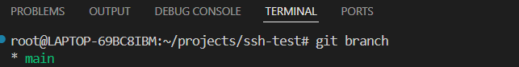
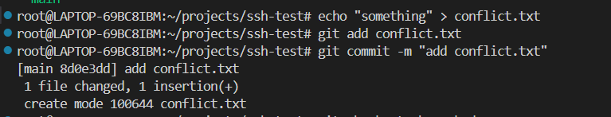
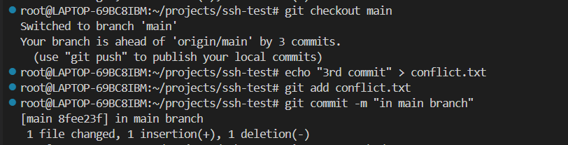
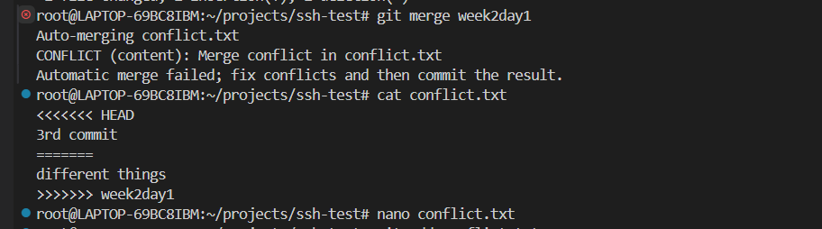
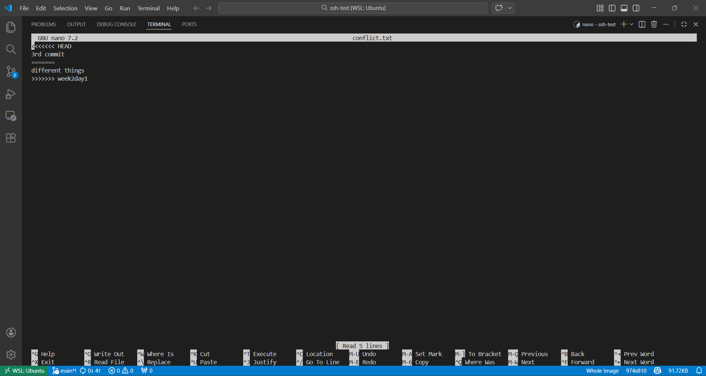
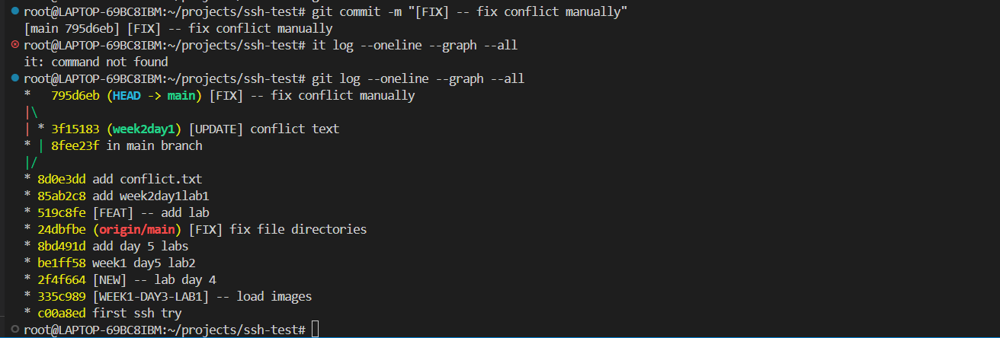
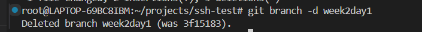
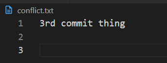

# Week 2 Day 1 Lab 1 Explanation

### 1. Check which branch we are on

---

### 2. Create a file and commit it

---

### 3. Create a new branch, modify the file there, and commit it

---

### 4. Switch to the main branch and make changes

---

### 5. Resolve the conflict that arises during merge

---

### 6. Complete the merge

---

### 7. Delete the branch

---

### 8. Final state of conflict.txt

checking branch
001
create new branch
002
switch to new branhch
003
verify
004.png
create a file
005
006