# Part A
I use vim for creating script
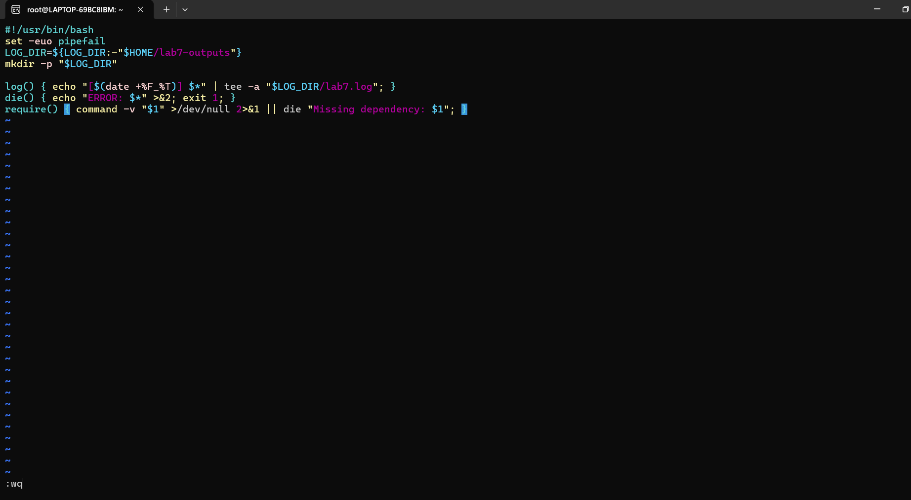
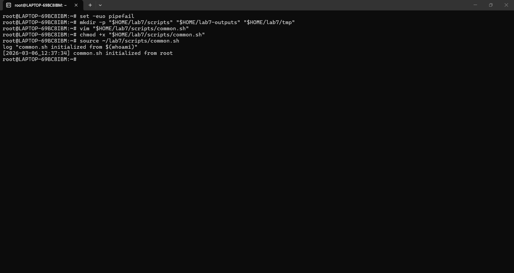
for running script
`bash`
chmod +x ./common.sh

source ~/lab7/scripts/common.sh
log "common.sh initialized from $(whoami)"
``
# Part B
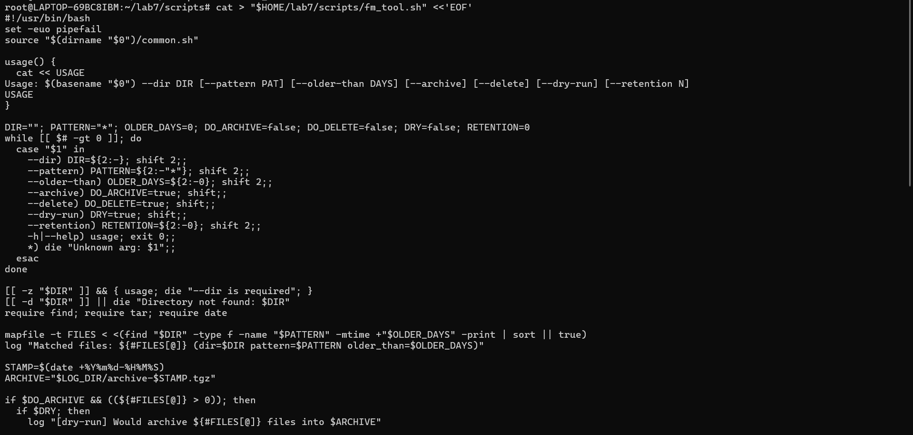
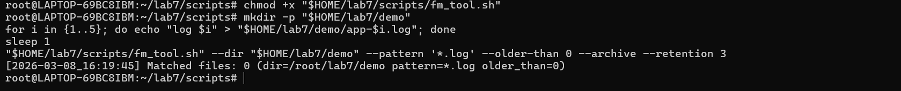

# Part C
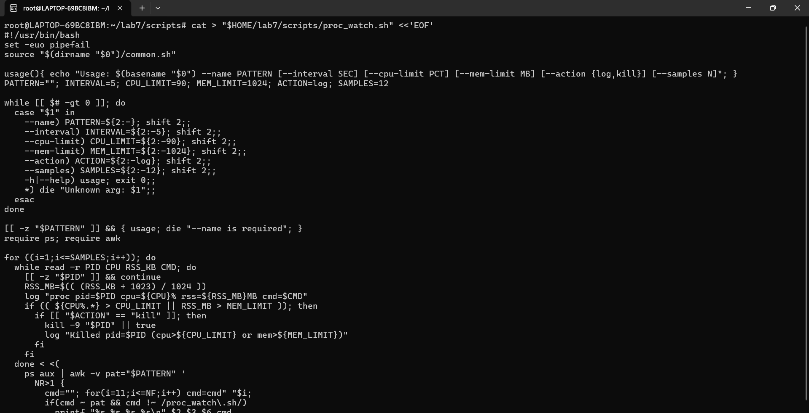
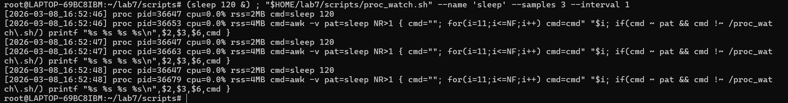
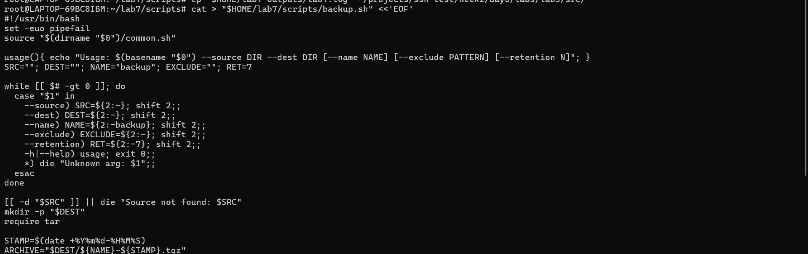
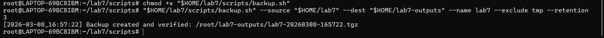
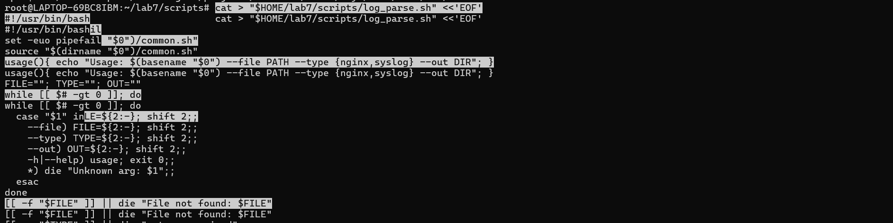
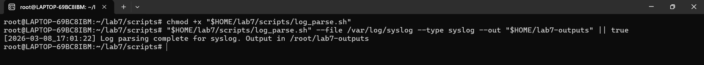
# PART F
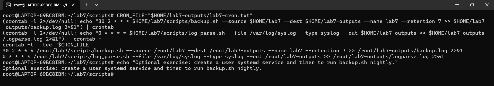
# PART G
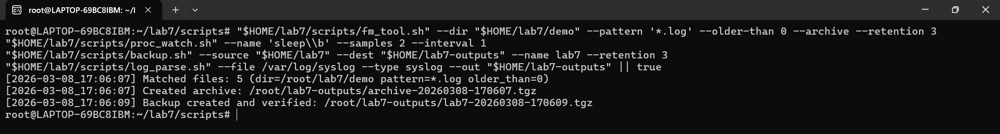